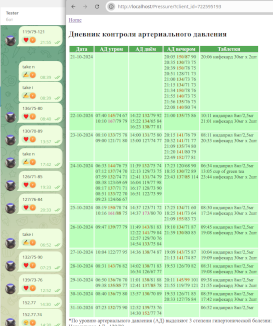

# Blood Pressure Recorder (telegram version)
Simple "Blood pressure recorder" using Teregram messages.

Write in a private message to Bot 120/80-90 (Up pressure/down pressure/pulse)

Simpe PHP code save data and make page for print on localhost.

Maintains separate records for each user who writes.

## Preview 


## Telegarm Bot command:
```
/start - help
/getstat - get all information about writes.
```
## Config
```
folders:
DB - for users (writes) blood pressure arhive (json file)
BACKUP - for saves telegram answers json files

in pressure_config.php need write Bot ID and Bot Key 

!!! Folders DB and BACKUP needs open for RW !!!
```


Good luck, if there is some interest, the project can be developed.
